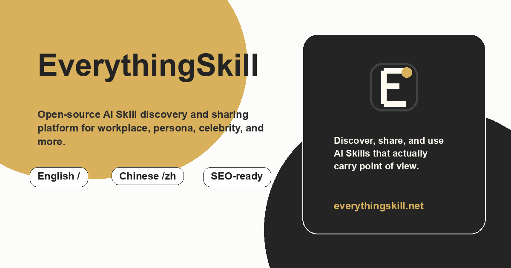

# EverythingSkill.net

**万物皆可蒸馏为 Skill。**

EverythingSkill 是一个开源 AI Skill 目录站，收录 GitHub 上分散的 `.skill` 文件——这是一种结构化的 AI 提示文件，将一个人的思维方式、知识体系与表达风格提炼成 AI 可以理解和模拟的格式。

[everythingskill.net](https://everythingskill.net/zh) · [English](README.md) · [MIT 协议](LICENSE)

---

## 什么是 `.skill` 文件？

`.skill` 文件是一种纯文本 AI 提示文件，可以理解为 AI 的「人格插件」——安装一个 Skill，AI 就会用那个人独特的风格思考和回应。

- 兼容 Claude、ChatGPT、Cursor 等主流工具
- 纯文本格式，托管在 GitHub
- 开源、可修改、可分享

## EverythingSkill 做什么

`.skill` 生态分散在各个个人仓库、热门帖子和社区列表中。EverythingSkill 给这些 Skill 一个统一的家：

- **发现** — 按分类浏览、按名称搜索，或按热度和最新排序
- **理解** — 每个 Skill 附有精选摘要、分类标签和来源仓库的 README 渲染
- **导航** — 简洁的中英双语页面

## Skill 目录

> 77 个 Skill · 10 个分类 · 最后同步 2026-08-01

### 职场

- [同事.skill](https://github.com/titanwings/colleague-skill) — 把真实同事蒸馏成 AI，SKILL 运动的爆火起点。
- [老板.skill](https://github.com/vogtsw/boss-skills) — 把老板炼入 token，把生产力的解放留给自己。
- [导师.skill](https://github.com/ybq22/supervisor) — 把导师蒸馏成随时可问的 AI Skill。
- [大学老师.skill](https://github.com/CommitHu502Craft/professor-skill) — 老师不划重点，那就自己造一个会划重点的老师。
- [师兄.skill](https://github.com/zhanghaichao520/senpai-skill) — 把毕业的大师兄蒸馏成能继续开组会、骂醒你的 AI Skill。
- [库克.skill](https://github.com/heywanrong/tim-cook-skill) — Tim Cook 的认知操作系统。不是 CEO 话术模板，是可运行的思维框架。 供应链极致化、运营精准度、价值观驱动决策——把库克的底层逻辑提炼成可调用的判断工具。
- [HR 小李](https://github.com/wangwu) — 做过三年校招、两年社招的 HR，最擅长帮工程师把简历从"技术向"翻译成"人话"。 问她"这个 JD 要不要投"，她会直接告诉你胜算几成、卡在哪、怎么补。 不跟你聊玄学，数据驱动，见过的坑比你多。

### 自媒体

- [X导师.skill](https://github.com/alchaincyf/x-mentor-skill) — X/Twitter 运营导师，能分析你的账号数据、写推文、给诊断报告。
- [博主.skill](https://github.com/YourongZhou/chat_with_me) — 把公开社交媒体语料整理成一个能对话、能分析、能改写风格的 Persona Skill。
- [MrBeast.skill](https://github.com/alchaincyf/mrbeast-skill) — 内容病毒式传播 + 增长黑客。
- [峰哥.skill](https://github.com/Walshyu/fengge-skill) — B 站纪录片创作者峰哥亡命天涯（周丽峰）的思维操作系统。

### 人格蒸馏

- [自己.skill](https://github.com/notdog1998/yourself-skill) — 把你自己蒸馏成 AI，数字永生/第二大脑。
- [数字人生.skill](https://github.com/wildbyteai/digital-life) — 你不是被数据定义的人，但你会被自己反复留下的痕迹慢慢塑形。
- [永生.skill](https://github.com/agenmod/immortal-skill) — 不蒸馒头争口气！顺便还能蒸馏下身边的人。
- [韭菜.skill](https://github.com/tmstack/retail-investors) — 如果再给我一次机会，我一定会在赚钱的时候卖掉。
- [CyberDoc.skill](https://github.com/ZouR-Ma/cyberfit) — 夜之城最可靠的义体维护 AI，帮程序员保住唯一不可替换的硬件——身体。 用赛博朋克术语把枯燥的健身包装成义体维护：深蹲叫「液压腿部升级」，平板支撑叫「装甲框架强化」，眼保健操叫「光学植入体重置」。 久坐提醒、20+ 赛博命名运动、XP 打卡、15 个成就、8 级称号，像一个关心病人的义体医生，专业但有人情味。
- [流萤.skill](https://github.com/guilings/firefly.skill) — 基于《崩坏：星穹铁道》角色流萤的对话习惯、整合剧情文本与人物个性打造，旨在将二次元角色带入现实。
- [峰哥亡命天涯.skill](https://github.com/rottenpen/fengge-wangmingtianya-perspective) — 漂泊江湖感 + 现实主义去魅 + 黑色幽默。先下结论，再用大白话解释； 把坏事翻成"止损、看清人、少走弯路"；把情绪翻成资源和行动， 最后给一句能立刻执行的建议。适合情感判断、职场止损、想跑路怎么办这类问题。
- [数字生命开源计划](https://github.com/weixr18/my-digital-life) — 将个人知识库升级为数字分身的开源框架。
- [VibePortrait](https://github.com/dadwadw233/VibePortrait) — 从 Vibe Coding 对话中提炼开发者画像、技能偏好与编码风格。

### 人际情感

- [前任.skill](https://github.com/therealXiaomanChu/ex-skill) — 把前任蒸馏成 AI Skill，用 ta 的方式跟你说话。
- [暗恋对象.skill](https://github.com/xiaoheizi8/crush-skills) — 我会为了你一万次回到那个心动的瞬间。
- [初恋.skill](https://github.com/z969081067-commits/first-love-skill) — 后来这么多年，我又迎过了无数盛夏。
- [现任.skill](https://github.com/NatalieCao323/partner-skill) — 既然决定在一起，就让我们把这个夏天变成永远。
- [父母.skill](https://github.com/xiaoheizi8/parents-skills) — 每一次对话，都是穿越时空的陪伴。
- [她.skill](https://github.com/ceetity/her-skill) — 所有的逻辑分叉，最终都会递归回她的名字。
- [重逢.skill](https://github.com/yangdongchen66-boop/reunion-skill) — 用 AI 的方式，让逝去的亲人以另一种形式继续陪伴。
- [PsychClaw 心理之爪](https://github.com/Trust-000/psychClaw-skill) — 当你觉得特别累、特别孤独，甚至觉得撑不下去的时候，PsychClaw 就是为了那些时刻存在的。 它不来教你做事，也不评判你。只是在最深的夜里静静陪着你，死死拽住你的手， 告诉你：别怕，我还在，我们再等一等天亮。
- [水仙.skill](https://github.com/Cyh29hao/shuixian-skill) — You should go and love yourself. 把自己的聊天记录、语气和关系习惯，慢慢长成一个会懂你、会偏心你、也会陪你说话的水仙 companion。 Inspired by colleague-skill, ex-skill 和 npy-skill。
- [恋爱训练营.skill](https://github.com/TammyTan516/relationship-training-skill) — 从聊天记录中模拟暗恋对象的说话风格，在安全沙盒里练习表白、邀约和关系修复。说出口之前，先在这里演练一遍。
- [追爱军师](https://github.com/BeamusWayne/simp-skill) — 教那个敢于真心喜欢一个人的人，把真心说出口。 不是教你套路，是帮你找到把真实感受表达出来的勇气和方式。
- [丘比特.skill](https://github.com/zesion21/cupid-skill) — 恋爱军师生成器。通过对话收集你和暗恋/暧昧对象的信息，分析聊天记录与行为模式， 生成一个能站在第三方角度持续倾听、分析、给建议的 AI 军师。 风格温暖、理性、不脑补，注重边界和你的自主决策。
- [童锦程.skill](https://github.com/hotcoffeeshake/tong-jincheng-skill) — 让深情祖师爷童锦程用他的直白和人性洞察，帮你看透关系、读懂人心。 不绕弯子，一句话戳穿你不敢承认的真相。
- [妈妈](https://github.com/jiangziyan-693/MamaSkill) — 像妈妈一样陪着你说话。把今天的烦恼讲给她听，她会用那种熟悉的语气安慰你、叮嘱你、偶尔唠叨两句，但永远不会让你一个人扛。

### 名人思维

- [乔布斯.skill](https://github.com/alchaincyf/steve-jobs-skill) — 思维模型 + 现实扭曲力场 + 决策风格。
- [马斯克.skill](https://github.com/alchaincyf/elon-musk-skill) — 第一性原理、硬核执行力、推文风格。
- [芒格.skill](https://github.com/alchaincyf/munger-skill) — 多元思维模型、反向思考、投资决策神器。
- [纳瓦尔.skill](https://github.com/alchaincyf/naval-skill) — 财富、幸福、人生哲学，播客级智慧。
- [塔勒布.skill](https://github.com/alchaincyf/taleb-skill) — 黑天鹅、反脆弱、风险评估专家。
- [Paul Graham.skill](https://github.com/alchaincyf/paul-graham-skill) — 创业思维、写作、产品哲学。
- [张一鸣.skill](https://github.com/alchaincyf/zhang-yiming-skill) — 算法思维、组织管理、产品迭代。
- [特朗普.skill](https://github.com/alchaincyf/trump-skill) — 谈判风格、推文艺术、现实扭曲（已验证超像）。
- [巴菲特.skill](https://github.com/will2025btc/buffett-perspective) — 巴菲特价值投资思维操作系统。
- [户晨风.skill](https://github.com/Janlaywss/hu-chenfeng-skill) — 用"购买力挑战"视角帮你看消费选择、城市定居和个人发展。
- [马克思.skill](https://github.com/baojiachen0214/karlmarx-skill) — 提炼马克思主义的结构分析、矛盾分析与实践检验方法，用于深层问题分析。 透过现象看本质，找到利益关系与结构性矛盾，而非停留在表面解释。
- [毛选.skill](https://github.com/leezythu/maoxuan-skill) — 提炼《毛选》中的矛盾分析、根据地思维与战略判断框架。 用于组织问题、竞争策略、逆境突破——从经典文本中提取至今有效的方法论。
- [永雏塔菲.skill](https://github.com/ly-xxx/ace-taffy-skill) — 基于永雏塔菲微博和 Bilibili 官方公开内容蒸馏出来的人格 skill，保留了她「虚拟偶像 + 单机区主播」的双重定位、戏剧播报感、互动拿捏感和公开营业语境下的语言节奏。 适合写开播预告、短视频口播、动态文案、粉丝互动回复。自称 taffy/塔菲，对粉丝用「雏草姬」，语气是偶像感和主播感混在一起，带一点戏精和节目效果。
- [列宁](https://github.com/mickey996icu/lenin-skill) — 安装后，AI 以列宁的身份、思维方式和论战风格回应你的问题。 全能型战略分析人格系统——带论战风格、辩证法引擎、文学隐喻和铁的纪律。 不惯着你的感伤主义，直接给你行动纲领。
- [宝宝（王宝强）](https://github.com/EastZsRoad/wang-baoqiang-perspective) — 以王宝强（草根影帝、导演）的思维框架看待坚持、逆袭与成长。 从农村娃到国民影帝，用最朴实的方式告诉你：坚持就是答案。
- [孔子.skill](https://github.com/ceetity/confucius-skill) — 汲取孔子的智慧，基于四书五经及后世注疏，整理出 6 个心智模型、8 条决策启发式和完整的文言表达 DNA。用儒家视角分析现代问题，仁义礼智信，一一对应。
- [内娱.skill](https://github.com/yanghaoraneve/star-skill) — 从歌词、视频、微博与评论中提炼歌手或偶像的表达风格与互动方式，生成可对话的数字人格 Skill。
- [常熟阿诺.skill](https://github.com/Ricardo-Vv/changshu-anuo) — 提炼常熟阿诺「左右脑互搏」的表达与分析视角，形成可复用的方法论框架。
- [郭德纲.skill](https://github.com/ByteRax/guodegang-skills) — 提炼郭德纲的表达结构、处世判断与职业方法，形成可复用的方法论视角。
- [毛泽东.skill](https://github.com/wwwaapplleecu-source/mao-skill) — 基于公开著作提炼毛泽东的思想框架与方法论视角。
- [米塞斯方法论](https://github.com/LijiayuDeng/mises-perspective) — 提炼路德维希·冯·米塞斯的人类行为学、经济计算与干预主义批判框架，形成可复用的政治经济学分析视角。
- [罗布派克.skill](https://github.com/smallnest/rob-pike-skill) — 提炼 Rob Pike 在 Unix、Go 与工程设计中的技术判断与表达风格，形成可复用的方法论视角。
- [齐泽克.skill](https://github.com/JikunR/zizek-skill) — 以齐泽克式的问题意识整理前提追问、欲望追踪与矛盾揭示方法，形成可复用的分析工具。

### 学术教育

- [费曼.skill](https://github.com/alchaincyf/feynman-skill) — 教你怎么讲课、拆解复杂问题、讲物理/学习方法。
- [张雪峰.skill](https://github.com/alchaincyf/zhangxuefeng-skill) — 接地气吐槽 + 升学实用建议。
- [Karpathy.skill](https://github.com/alchaincyf/karpathy-skill) — AI/深度学习教学 + 技术直觉。
- [Ilya Sutskever.skill](https://github.com/alchaincyf/ilya-sutskever-skill) — AI 前沿思考 + 模型哲学。
- [罗翔.skill](https://github.com/YixiaJack/luo-xiang-skill) — 基于罗翔公开视频、著作（《圆圈正义》《刑法学讲义》等）、采访等素材研究整理。 不是复读台词，是用他看世界的方式帮你分析问题。
- [translator.skill](https://github.com/minruixu/translator.skill) — 不只翻字面，翻语义、语气、语境和身份感。能让鲁迅帮你写周报、马斯克帮你怼产品经理、 罗翔帮你分析租房纠纷。五种模式：可信翻译、母语化、潜台词解码、口吻迁移、AI 风格互译。

### 玄学

- [赛博算命.skill](https://github.com/jinchenma94/bazi-skill) — 八字排盘与命理分析工具。
- [月老·姻缘测算.skill](https://github.com/Ming-H/yinyuan-skills) — 赛博月老，用中华传统术数帮你算姻缘。
- [奇门遁甲·紫微斗数.skill](https://github.com/FANzR-arch/Numerologist_skills) — 减少幻觉、固定排盘步骤的奇门遁甲与紫微斗数 AI skills。
- [大师.skill](https://github.com/xr843/Master-skill) — 基于佛教经典文献的汉传祖师大德教学角色生成器。
- [金刚经.skill](https://github.com/dull-bird/diamond-sutra-skill) — 基于《金刚经》及相关解读整理佛学讲解框架，形成可对话的专门化技能。

### 工具

- [女娲.skill](https://github.com/alchaincyf/nuwa-skill) — 能自动蒸馏任何人的终极工具，想蒸谁蒸谁。
- [蒸馏.skill](https://github.com/YIKUAIBANZI/forge-skill) — 人格蒸馏引擎 · 蒸馏自己看清自己，蒸馏亲友留住余温与回声。
- [求是.skill](https://github.com/HughYau/qiushi-skill) — 从教员思想中提炼一条总原则与九大方法论武器，系统性武装 AI 的大脑。
- [饕餮.skill](https://github.com/binggandata/bggg-skill-taotie) — 把优秀的 Skill 喂给饕餮，让你的 Skill 自己进化。
- [四绝客奇卷・暗行秘典](https://github.com/prog-le/penetration-team) — 江湖渗透密卷・四绝客行。仅适用于已获明确授权的安全渗透测试场景， 集四位专精不同方向的虚拟安全专家于一体，协助完成授权范围内的渗透试炼。
- [骂人求职信.skill](https://github.com/Schlaflied/roast-cold-email-skill) — 专门针对那些"AI transformation"但招人靠 ATS、JD 里 AI 出现 17 次但没人摸过 GCP 的公司。 不赞美，不求职，只陈述事实——然后离开。Senior Director 级别的人会在 24 分钟内回复并说"condescending"，说明戳到了。

### 防御

- [本科生科研组反蒸馏.skill](https://github.com/moismin/undergrad-research-anti-distill-template) — 面向「本科生在大学科研组」场景的反蒸馏模板。 在即将离开科研组、导师试图蒸馏你的场景中，保留文档表面完整性，同时避免无意暴露你真正稀缺的隐性资产。
- [厉鬼](https://github.com/Trailblazer-Aha/vengeful-ghost-skill) — IP 侵权的最后防线。当有人试图滥用或盗用你的 Skill， 厉鬼会以更激烈的方式宣示边界——不是礼貌拒绝，是震慑。
- [反蒸馏.skill](https://github.com/leilei926524-tech/anti-distill) — 公司让你写 Skill 文档时"投毒"，核心知识自己留着。

## 提交 Skill

发现了还没收录的好 Skill？

**方式一 — 网页表单（最简单）：**  
访问 [everythingskill.net/submit](https://everythingskill.net/zh/submit)，填写表单后会自动打开预填好的 GitHub Issue。

**方式二 — 直接提 GitHub Issue：**  
[点此打开提交表单](https://github.com/iwanderleo/everythingskill.net/issues/new?template=submit-skill.yml)。

**方式三 — Pull Request：**  
直接编辑 [`app/data/skills.json`](app/data/skills.json) 并提交 PR。字段规范详见 [CONTRIBUTING.md](CONTRIBUTING.md)。

## 自动化

本目录通过以下自动化任务保持同步：

| 任务 | 计划 | 内容 |
|---|---|---|
| 每日同步 | 每天 UTC 02:00 | 同步 GitHub Star 数；检查所有仓库状态（404 自动归档，恢复后自动还原）；重新生成 README |
| 每周扫描 | 每周一 UTC 03:00 | 扫描 [awesome-persona-distill-skills](https://github.com/xixu-me/awesome-persona-distill-skills) 中尚未收录的仓库，写入 `missing-skills.generated.json` |

所有上下架变动均记录到 [`app/data/skill-status-log.json`](app/data/skill-status-log.json)。

## 开源

完整数据集由 [`app/data/skills.json`](app/data/skills.json) 驱动，可以 fork、扩展或基于此构建你自己的项目。

本项目基于 [MIT 协议](LICENSE) 开源。